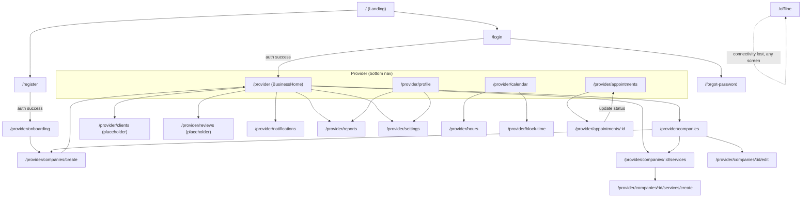
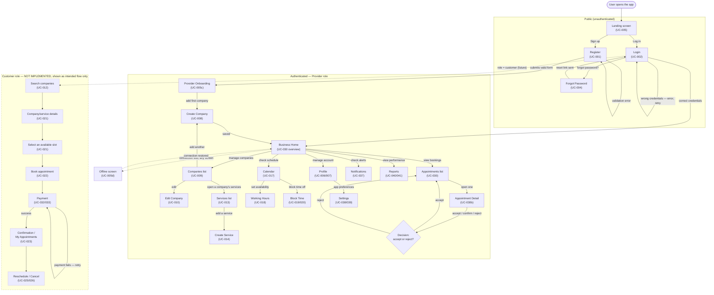

# Bookas – Use Cases (Frontend)

This file lists the frontend use cases and maps them to the BookPro API use cases where applicable. Missing API support is noted so implementation can be prioritized.

## Mapping notes

- Where an API UC exists we map to `API UC-##` and include the route.
- Items marked `[NO API YET]` indicate frontend features that have no direct backend endpoint today.
- Items marked `[NOT IMPLEMENTED]` indicate use cases with no screen/route built yet (as of this update, only the **provider** side is implemented — no customer-facing booking screens exist).
- Route column reflects the actual routes defined in [routes.tsx](../../src/app/routes.tsx) and the per-feature `*-routes.tsx` files under `src/features/*`.
- The codebase has moved from a screens-under-`src/app` layout to a feature-based layout (`src/features/<feature>/screens/*`, `src/features/<feature>/routes.tsx`); this document has been updated to match.

## Screens (implemented)

Public:

| Screen          | Route              | Component                                                                |
| --------------- | ------------------ | ------------------------------------------------------------------------ |
| Landing         | `/`                | [Landing.tsx](../../src/features/landing/screens/Landing.tsx)            |
| Login           | `/login`           | [Login.tsx](../../src/features/auth/screens/Login.tsx)                   |
| Register        | `/register`        | [Register.tsx](../../src/features/auth/screens/Register.tsx)             |
| Forgot Password | `/forgot-password` | [ForgotPassword.tsx](../../src/features/auth/screens/ForgotPassword.tsx) |

Extra:

| Screen              | Route                  | Component                                                                              | Notes                                                       |
| ------------------- | ---------------------- | -------------------------------------------------------------------------------------- | ----------------------------------------------------------- |
| Onboarding          | `/onboarding`          | [Onboarding.tsx](../../src/features/onboarding/screens/Onboarding.tsx)                 |                                                             |
| Provider Onboarding | `/provider/onboarding` | [ProviderOnboarding.tsx](../../src/features/onboarding/screens/ProviderOnboarding.tsx) | Route path changed from the previous `/onboarding-provider` |
| Offline             | `/offline`             | [Offline.tsx](../../src/features/onboarding/screens/Offline.tsx)                       |                                                             |

Provider (wrapped in [ProviderLayout.tsx](../../src/app/layouts/ProviderLayout.tsx)):

| Screen                | Route                                     | Component                                                                                              |
| --------------------- | ----------------------------------------- | ------------------------------------------------------------------------------------------------------ |
| Business Home         | `/provider`                               | [BusinessHome.tsx](../../src/features/business-home/screens/BusinessHome.tsx)                          |
| Companies             | `/provider/companies`                     | [Companies.tsx](../../src/features/companies/screens/Companies.tsx)                                    |
| Create Company        | `/provider/companies/create`              | [CreateCompany.tsx](../../src/features/companies/screens/CreateCompany.tsx)                            |
| Edit Company          | `/provider/companies/:id/edit`            | [CreateCompany.tsx](../../src/features/companies/screens/CreateCompany.tsx)                            |
| Services              | `/provider/companies/:id/services`        | [Services.tsx](../../src/features/services/screens/Services.tsx)                                       |
| Create Service        | `/provider/companies/:id/services/create` | [CreateService.tsx](../../src/features/services/screens/CreateService.tsx)                             |
| Clients (placeholder) | `/provider/clients`                       | [Companies.tsx](../../src/features/companies/screens/Companies.tsx)                                    |
| Appointments          | `/provider/appointments`                  | [ProviderAppointments.tsx](../../src/features/appointments/screens/ProviderAppointments.tsx)           |
| Appointment Detail    | `/provider/appointments/:id`              | [ProviderAppointmentDetail.tsx](../../src/features/appointments/screens/ProviderAppointmentDetail.tsx) |
| Calendar              | `/provider/calendar`                      | [Calendar.tsx](../../src/features/scheduling/screens/Calendar.tsx)                                     |
| Hours                 | `/provider/hours`                         | [Hours.tsx](../../src/features/scheduling/screens/Hours.tsx)                                           |
| Block Time            | `/provider/block-time`                    | [BlockTime.tsx](../../src/features/scheduling/screens/BlockTime.tsx)                                   |
| Notifications         | `/provider/notifications`                 | [Notifications.tsx](../../src/features/notifications/screens/Notifications.tsx)                        |
| Profile               | `/provider/profile`                       | [ProviderProfile.tsx](../../src/features/settings-profile/screens/ProviderProfile.tsx)                 |
| Settings              | `/provider/settings`                      | [ProviderSettings.tsx](../../src/features/settings-profile/screens/ProviderSettings.tsx)               |
| Reports               | `/provider/reports`                       | [Reports.tsx](../../src/features/reports/screens/Reports.tsx)                                          |
| Reviews (placeholder) | `/provider/reviews`                       | [Reports.tsx](../../src/features/reports/screens/Reports.tsx)                                          |

Unrouted component found in the repo: [Dashboard.tsx](../../src/features/business-home/screens/Dashboard.tsx) (exports `ProviderDashboard`) exists but is not wired into any `*-routes.tsx` file and is not imported anywhere else — likely in-progress or leftover code, not a real screen. Flagged for follow-up rather than assumed complete.

Not yet implemented: customer-facing screens (company/service search, available slots, booking, my appointments, payments).

## 1. Onboarding

- UC-001: User Registration → `/register` → API UC-01 (`POST /api/v1/accounts/register`) — form now uses `react-hook-form` + `zod` validation ([useRegisterForm.ts](../../src/features/auth/hooks/useRegisterForm.ts), [register.schema.ts](../../src/features/auth/schemas/register.schema.ts)); on success navigates directly to `/provider/onboarding`
- UC-002: User Login → `/login` → API UC-02 (`POST /api/v1/accounts/login`) — on success navigates directly to `/provider`
- UC-003: Google Login → API UC-03 (`POST /api/v1/accounts/google-login`) — [NOT IMPLEMENTED] add if providing social auth
- UC-004: Password Recovery → `/forgot-password` → API UC-04 / UC-05 (`POST /api/v1/accounts/forgot-password`, `POST /api/v1/accounts/reset-password`)
- UC-005: Generic Onboarding (intro/carousel) → `/onboarding`
- UC-005c: Provider Onboarding (minimum info) → `/provider/onboarding`, uses `Create Company` + `Add Service` flows (see below)
- UC-005d: Offline state screen → `/offline`

## 2. Profile

- UC-006: View Provider Profile → `/provider/profile` → API UC-06 (`GET /api/v1/users/profile`)
- UC-007: Edit Provider Profile → `/provider/profile` → API UC-08 (`PUT /api/v1/users/profile`)

## 3. Company (Provider)

- UC-008: Create Company → `/provider/companies/create` → API UC-09 (`POST /api/v1/companies`)
- UC-009: View Companies → `/provider/companies` → API UC-10 (`GET /api/v1/companies`)
- UC-010: Edit Company → `/provider/companies/:id/edit` → API UC-13 (`PUT /api/v1/companies/{id}`)
- UC-011: Delete Company → [NO API YET] (consider restricting or implementing)
- UC-012: Search Companies → [NOT IMPLEMENTED] → API UC-14 (`GET /api/v1/companies/search`)

## 4. Services (Offerings)

- UC-013: View Services → `/provider/companies/:id/services` → API UC-22 (`GET /api/v1/companies/{companyId}/services`)
- UC-014: Create Service → `/provider/companies/:id/services/create` → API UC-21 (`POST /api/v1/companies/{companyId}/services`)
- UC-015: Edit Service → [NOT IMPLEMENTED] (no dedicated edit route yet) → API UC-23 (`PUT /api/v1/companies/{companyId}/services/{serviceId}`)
- UC-016: Delete Service → [NOT IMPLEMENTED] → API UC-24 (`DELETE /api/v1/companies/{companyId}/services/{serviceId}`)

## 5. Calendar (Frontend-first; limited API support)

- UC-017: View Calendar → `/provider/calendar` → [FRONTEND]
- UC-018: Configure Working Hours → `/provider/hours` → [NO API YET]
- UC-019: Block Time Slots → `/provider/block-time` → [NO API YET]
- UC-020: Unblock Time Slots → [NO API YET] (managed within Block Time screen)

Note: Calendar features are primarily UI/UX and will require new backend endpoints or a document store if provider-side scheduling is to be persisted.

## 6. Appointments — Customer flows

- UC-021: Get Available Slots → [NOT IMPLEMENTED] → API UC-15 (`GET /api/v1/companies/{companyId}/available-slots`)
- UC-022: Book an Appointment → [NOT IMPLEMENTED] → API UC-25 (`POST /api/v1/appointments`)
- UC-023: View My Appointments → [NOT IMPLEMENTED] → API UC-26 (`GET /api/v1/appointments`)
- UC-024: Get Appointment Details → [NOT IMPLEMENTED] → API UC-27 (`GET /api/v1/appointments/{id}`)
- UC-025: Update/Reschedule Appointment → [NOT IMPLEMENTED] → API UC-28 (`PUT /api/v1/appointments/{id}`)
- UC-026: Cancel Appointment → [NOT IMPLEMENTED] → API UC-29 (`PUT /api/v1/appointments/{id}/cancel`)
- UC-027: Delete Appointment → [NOT IMPLEMENTED] → API UC-30 (`DELETE /api/v1/appointments/{id}`)
- UC-028: Upcoming Appointments view → [NOT IMPLEMENTED] → API UC-32 (`GET /api/v1/appointments/upcoming`)
- UC-029: Appointment History → [NOT IMPLEMENTED] → API UC-33 (`GET /api/v1/appointments/history`)

Note: No customer-facing screens exist yet — only public auth screens (Landing, Login, Register, ForgotPassword) and provider screens are implemented. All customer booking UCs above still need screens/routes.

## 7. Appointments — Provider flows

- UC-030: View Appointments as Provider → `/provider/appointments` → API UC-34 (`GET /api/v1/appointments/as-provider`)
- UC-030b: View Appointment Detail as Provider → `/provider/appointments/:id`
- UC-031: Update Appointment Status (Accept/Confirm/Reject) → `/provider/appointments/:id` → API UC-31 (`PUT /api/v1/appointments/{id}/status`)

Mapping note: combine "accept" and "reject" into the `Update Appointment Status` flow to avoid duplicate UCs.

## 8. Payments (Important — add to frontend)

- UC-032: Process Payment → [NOT IMPLEMENTED] → API UC-35 (`POST /api/v1/payments/process`)
- UC-033: Get Payment Status → [NOT IMPLEMENTED] → API UC-36 (`GET /api/v1/payments/{id}/status`)
- UC-034: Refund Payment → [NOT IMPLEMENTED] → API UC-37 (`POST /api/v1/payments/{paymentId}/refund`)
- UC-035: Payment History → [NOT IMPLEMENTED] → API UC-38 (`GET /api/v1/payments/history`)
- UC-036: Add/View Payment Methods → [NOT IMPLEMENTED] → API UC-39 / UC-40 (`POST/GET /api/v1/payments/methods/{userId}`)

Note: Payments are defined on the API but have no screens implemented yet — add them to the checkout flow.

## 9. Notifications & Settings

- UC-037: View Notifications → `/provider/notifications` → [NO API YET]
- UC-038: Manage Settings → `/provider/settings` → [NO API YET]
- UC-039: Manage Notification Preferences → [NO API YET] (managed within Notifications/Settings screens)

## 10. Analytics & Reports

- UC-040: View Analytics Dashboard → `/provider/reports` → [NO API YET]
- UC-041: Generate Reports → `/provider/reports` → [NO API YET]

## 11. Placeholders (routed but reusing another screen)

- Clients list (`/provider/clients`) currently renders the Companies screen as a placeholder pending a dedicated Clients screen.
- Reviews (`/provider/reviews`) currently renders the Reports screen as a placeholder pending a dedicated Reviews screen.

---

## Frontend sequencing recommendation (minimal provider onboarding)

1. Sign up / Login
2. Create Company (basic details)
3. Add one Service (name, duration, price)
4. Configure simple availability (quick UI) — if backend missing, use client-side defaults
5. Publish booking link and create first example appointment (onboarding demo)
6. Add payment method (optional)

This sequence reduces friction while showing value quickly.

---

## Screen navigation diagram

Diagram reflects the routes actually registered in [routes.tsx](../../src/app/routes.tsx) and the observed `navigate()` calls in each screen (not just the static route table). All `/provider/*` screens share the `ProviderLayout` (bottom nav: Home, Calendar, Appointments, Profile).

Notes:

- Customer-facing booking screens (search company, view slots, book/cancel appointment) do not exist yet; the diagram only covers public auth and provider screens.
- `clients` and `reviews` routes are placeholders that currently render the Companies and Reports screens respectively.
- The previously orphaned `/role-switch` screen and route have been removed from the codebase (2026-09-12) since nothing navigated to it.

---

## User journey (normal user's path through the app)

Unlike the route diagram above, this focuses on the **experience**, not the tree of routes: what a person actually sees, does, and decides at each step, and which use case each step satisfies. Two journeys exist today — the **Provider** journey (fully built) and the **Customer** journey (not implemented, shown as intent only).

Key points shown in this journey:

- **Authentication boundary**: everything in the "Public" box requires no session; everything in "Authenticated — Provider role" requires a logged-in provider. The Offline screen can interrupt from anywhere.
- **Decisions**: Register/Login form validation (retry on error), and the accept/reject decision on an appointment.
- **Error/retry flows**: invalid registration form loops back to Register; wrong credentials loop back to Login; a failed payment (customer journey) would loop back to Payment.
- **Roles**: Provider role is fully built (solid boxes); Customer role is drawn with dashed boxes to make clear it's the _intended_ journey only — no screens exist for it yet (see UC-021 through UC-036 in the sections above).
- **Screen ↔ use case relationship**: every node names the use case(s) it satisfies, so this diagram can be read directly against the "Use Cases" sections above and against [screens.md](./screens.md).

---

## Consistency check: Use Cases ↔ Screens ↔ User Navigation Flow

Walking `Use Case → Required Screen(s) → User Action → Navigation → Next Use Case` for each area:

| Use case                                                   | Screen(s)                      | Consistent with navigation flow?                                                                                                                    |
| ---------------------------------------------------------- | ------------------------------ | --------------------------------------------------------------------------------------------------------------------------------------------------- |
| UC-001 Register                                            | Register                       | ✅ Yes — leads to UC-005c                                                                                                                           |
| UC-002 Login                                               | Login                          | ✅ Yes — leads to UC-030 (Home)                                                                                                                     |
| UC-004 Password Recovery                                   | Forgot Password                | ✅ Yes — loops back to Login                                                                                                                        |
| UC-005c Provider Onboarding                                | Provider Onboarding            | ✅ Yes — leads to UC-008                                                                                                                            |
| UC-008/009/010 Company management                          | Create/List/Edit Company       | ✅ Yes                                                                                                                                              |
| UC-013/014 Services                                        | Services list / Create Service | ✅ Yes                                                                                                                                              |
| UC-015/016 Edit/Delete Service                             | —                              | ⚠️ **Partial** — use case is documented, no screen exists, so it cannot appear in the navigation flow                                               |
| UC-017–020 Calendar/Hours/Block Time                       | Calendar / Hours / Block Time  | ✅ Yes                                                                                                                                              |
| UC-030/030b/031 Provider appointments                      | Appointments list / Detail     | ✅ Yes                                                                                                                                              |
| UC-037 Notifications                                       | Notifications                  | ✅ Yes                                                                                                                                              |
| UC-038/039 Settings                                        | Settings                       | ✅ Yes                                                                                                                                              |
| UC-040/041 Reports                                         | Reports                        | ✅ Yes                                                                                                                                              |
| UC-012, UC-021–UC-029, UC-032–UC-036 (customer + payments) | none                           | ⚠️ **Pending** — consistently marked `[NOT IMPLEMENTED]` across use-cases.md, screens.md and this diagram (dashed) — no inconsistency, just unbuilt |
| `Dashboard.tsx` (`ProviderDashboard`)                      | exists, unrouted               | ❌ **No matching use case or navigation step** — flagged in screens.md; not shown in this diagram because it isn't reachable                        |
| `Clients` / `Reviews` placeholder routes                   | render Companies / Reports     | ⚠️ **Partial** — reachable in navigation (via Home) but have no dedicated use case of their own                                                     |

**Overall**: the three artifacts are consistent for everything that is actually built — every implemented screen maps to a use case and a reachable navigation step, and every pending use case is consistently marked as not implemented in all three places. The remaining exceptions are `Dashboard.tsx` (no use case, no route) and `Clients`/`Reviews` (reachable but use-case-less placeholders). `/role-switch` was removed on 2026-09-12 since it was unreachable and had no clear owner.
